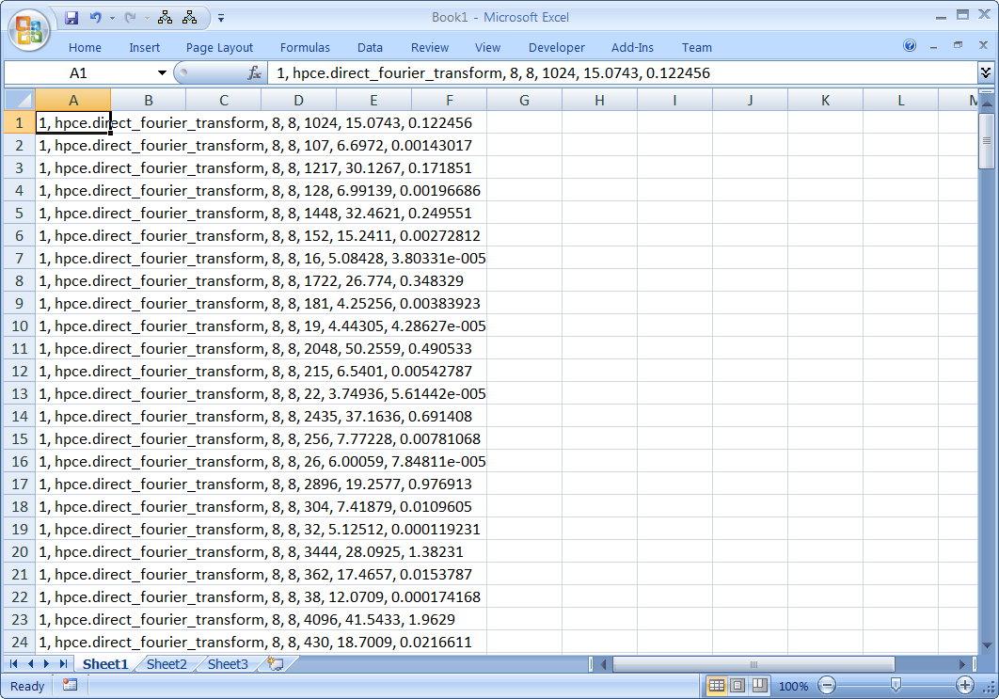
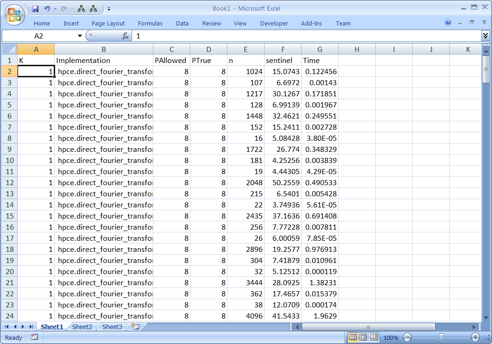
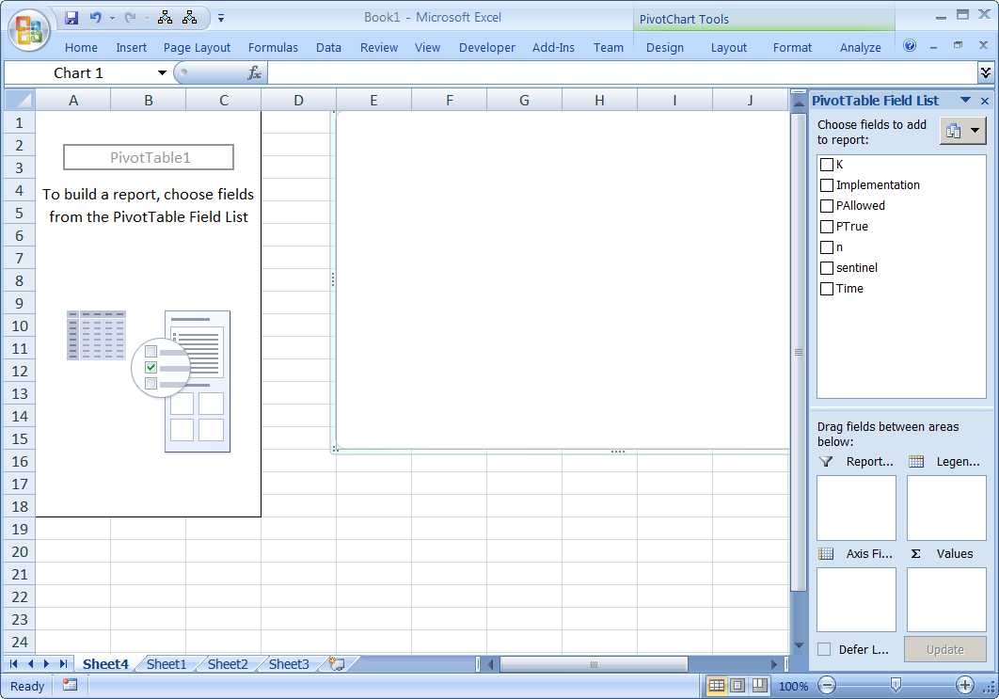
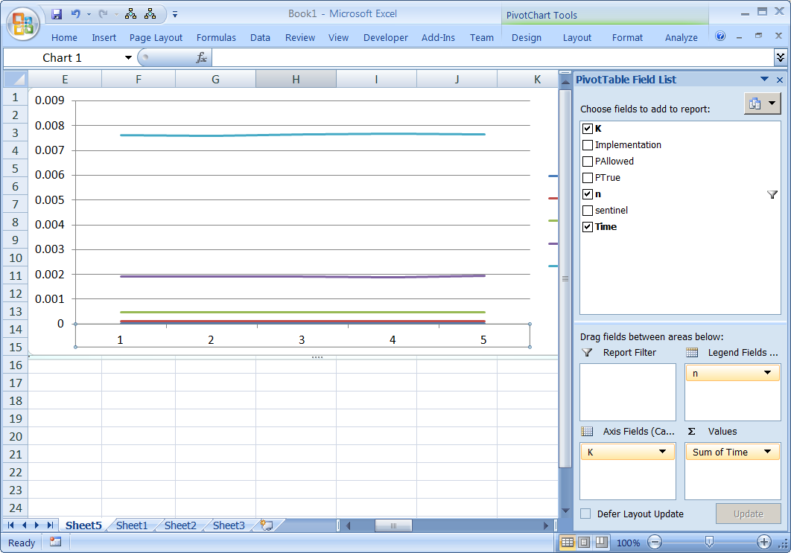
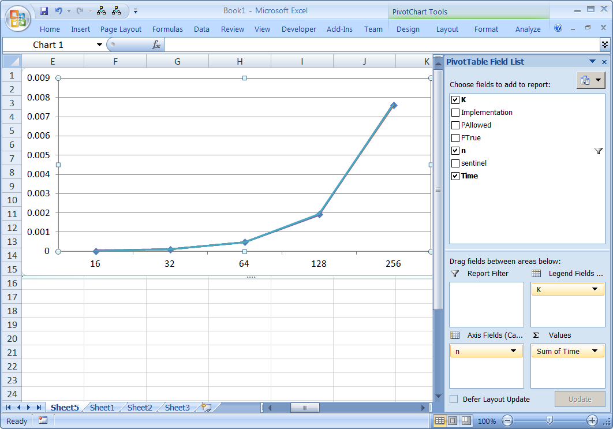

Automation is a great way of helping to gather results,
and it can also help you get the data into a format that
you can experiment with.

## Gathering data in CSV

Notice that `bin/time_fourier_transform` has four parameters
(try running it with no parameters again):

    1. `name` : the implementation to benchmark.

    2. `P` : the number of CPUs to enable, where 0 means use all available.

    3. `maxTime` : total time to allow for all runs.

    4. `prefix` : a prefix which will precede each output line.

Also, notice that each output row is a row of comma seperated values, which
means the output is _also_ a csv file. If you do:

    bin/time_fourier_transform hpce.direct_fourier_transform 0 4 > dump.csv

then you'll end up with a file called `dump.csv`. This can be loaded
into Excel, OpenOffice, matlab, python, etc., and used to explore
the data or plot graphs.

If you do:

    export HPCE_DIRECT_INNER_K=8
    bin/time_fourier_transform hpce.direct_fourier_transform 0 4 "${HPCE_DIRECT_INNER_K}, "

then you'll see that you have:

- selected a specific K, and
- benchmarched with that K, and
- prefixed the value of K to the output of each csv row.

Going further, you can do:

    export HPCE_DIRECT_INNER_K=8
    bin/time_fourier_transform hpce.direct_fourier_transform 0 4 "${HPCE_DIRECT_INNER_K}, " > dump_${HPCE_DIRECT_INNER_K}.csv

and you'll end up with a file called `dump_8.csv`, containing all the rows
for the run with K=8.

We can combine this with iteration in the shell:

    # Create a variable with a list of K values
    KS="1 2 3 4 5"
    # Iterate over them and print (echo) them
    for K in $KS; do
        echo $K;
    done

Bringing both of those together we can run the program for
multiple K values, and have them written to csv. At this
point the shell command will be getting very unwieldy. I
suggest you create a file called `results/direct_outer_versus_k.sh`,
and then add the following:

    #!/bin/bash
    # The above shows that it is a bash file

    # Create a variable with a list of K values
    KS="1 2 4 6 8 10 12"
    # Iterate over them and print (echo) them
    for K in $KS; do
        # Select the specific value of K
        export HPCE_DIRECT_INNER_K=${K}
        # Run the program with the chosen K, and save to dump_K.csv
        bin/time_fourier_transform hpce.direct_fourier_transform 0 4 "${HPCE_DIRECT_INNER_K}, " > dump_${HPCE_DIRECT_INNER_K}.csv
    done

If you are in "true" unix, you will then need to do:

    chmod u+x results/direct_outer_versus_k.sh

This indicates that the user (`u`), i.e. you, should
be able to execute (`x`) this file.

You can then run it using:

    results/direct_outer_versus_k.sh

It may take some time to run, but you will see the
files called `wibble_1.csv`, `wibble_2.csv` and so
on start to be written.

Ok - I sense you are not impressed. What is the point?

We now have a bunch of files, each of which contains many
rows for the same K. If we take all of those rows across
all the files, we have all the data needed to plot the graph.

If you run:

    cat wibble_*.csv

then it will take all the rows and dump to the screen.

If instead you run:

    cat wibble_*.csv > all.csv

it will take all those rows and send them to a file
called `all.csv`. Now we are ready to pivot!

### Pivot!

Excel is one tool that has good pivot features, but
open office has it too, and you can do it in matlab
as well. If you have a csv file, with a number of
columns, then pivot tables let you:

- Select a column for the for the x-axis

- Select a column which will be plotted on the y-axis

- Choose a subset of data-series to plot as lines

You kind of need to play with it, but it is very valuable
for scenarios where you have a lot of data and
want to view it in different ways.

A rough guide is:

1. Bring your .csv into Excel.

   

2. Use "text to columns" to turn it into columnar data.

   

3. Add named headers to the columns.

   

4. Select your data and insert a pivot-chart.

   

5. Select the columns you want on as the x-axis, values,
   and categories (see stuff on the right).

   

6. If you want to swap the rows and columns, then pivot.

   

